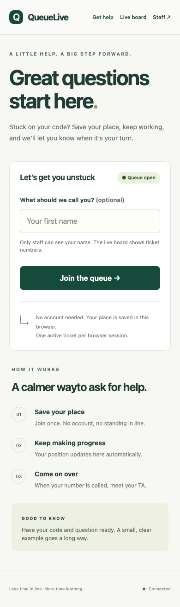
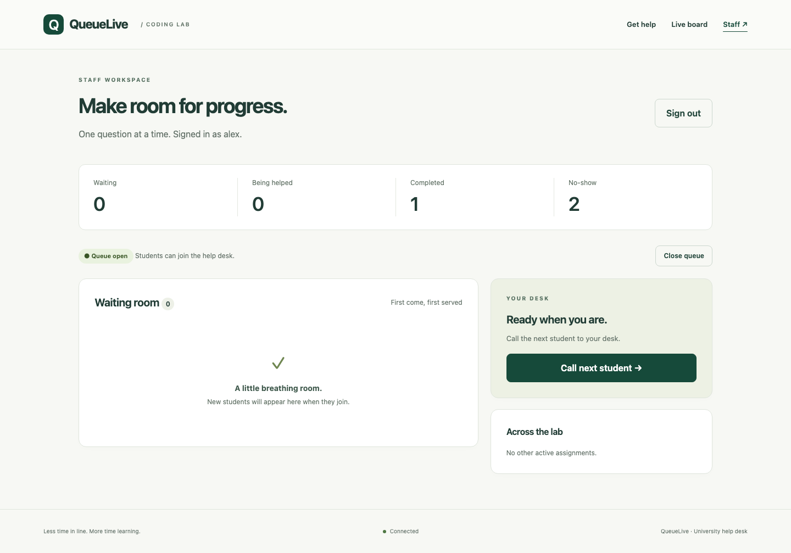
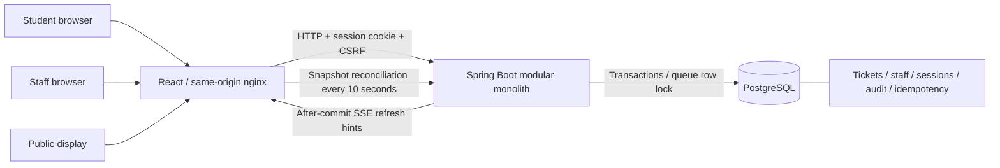

# QueueLive

A real-time help queue for university coding labs. Students join without an account, staff call the next student, and a public board shows ticket numbers and a QR code. The application uses a real PostgreSQL database; there is no mock backend.

**Stack:** Java 21, Spring Boot 3.5.16, Maven Wrapper 3.9.11, PostgreSQL 17.11, Flyway, Spring Security and JDBC sessions; React 19, TypeScript, Vite; SSE with HTTP mutations and polling recovery.

These are captures from the locally running application:

| Student phone view | Staff desktop view |
|---|---|
|  |  |

## Start the local demo

Prerequisites: Docker Engine/Desktop with Compose v2, Git, and a browser. Docker must be running. The container build supplies Java, Maven, Node and nginx; host Java/Node are not needed for this path.

```sh
cp .env.example .env
# Edit .env: choose DATABASE_PASSWORD and a DEMO_STAFF_PASSWORD of at least 12 characters and at most 72 UTF-8 bytes.
docker compose up --build -d
# Wait for the backend's "Started QueueLiveApplication" log:
docker compose logs -f backend
```

Open **http://localhost:8080**. Staff use **http://localhost:8080/staff**; the board is **http://localhost:8080/display**. Sign in as `alex` and `sam` using the password you put in `.env`, then **Open queue**. The queue starts closed.

Demo accounts are inserted only when `DEMO_ENABLED=true`. There is no built-in password. Existing account hashes are never overwritten when the app restarts. Changing the environment password does not reset existing accounts. Disable demo provisioning outside disposable demos.

Use separate browser profiles or private windows for two students and two staff: tabs normally share cookies. Each staff member may hold one assignment. Student sessions persist in PostgreSQL and remain valid for seven days of inactivity; clearing cookies or closing a browser configured to discard session cookies loses access.

Stop without deleting data: `docker compose down`. The named volume preserves tickets and sessions. Do not remove it unless you intend to erase your demo database.

### QR code on a phone

`PUBLIC_BASE_URL` must be the browser-reachable origin. `localhost` on a phone means the phone itself. For a private LAN demo, set the public URL to your computer's LAN IP and explicitly change the frontend port binding in Compose from `127.0.0.1:8080:8080` to `8080:8080`. That exposes the demo to the LAN; use only a trusted network. No public deployment is configured or performed.

## Develop locally

Prerequisites: JDK 21, Node 24.13.1/npm 11, plus Docker for PostgreSQL and Testcontainers. No global Maven required. From the root:

```sh
cp .env.example .env
# Set your own local passwords in .env first.
docker compose up -d db
# In this terminal, load your trusted local .env:
set -a
. ./.env
set +a
cd backend
PUBLIC_BASE_URL=http://localhost:5173 ./mvnw spring-boot:run
```

In another terminal:

```sh
cd frontend
npm ci
npm run dev
```

Open **http://localhost:5173**. The command above sets the public URL to this Vite origin so the development QR code is correct. Vite proxies `/api` to port 8080, so browser requests and cookies remain same-origin. Use the Vite URL for the UI; backend port 8080 serves only the API in this mode. Windows users can use `mvnw.cmd` and set the same variables through PowerShell.

## Checks

```sh
cd backend
./mvnw verify                  # Real PostgreSQL via Testcontainers; Docker required
cd ../frontend
npm ci
npm run build                 # Strict TypeScript + production bundle
npx playwright install chromium
# Start the full demo first; export the same configured demo password:
DEMO_STAFF_PASSWORD='your-local-password' npm run test:e2e
```

Browser tests need a disposable queue without existing waiting or active tickets; they exercise real services and mutate data. Set `BASE_URL=http://localhost:5173` for the development UI. See [testing](docs/testing.md) for the external-PostgreSQL test option, acceptance coverage, CI, and actual verification results. [Load-test instructions](docs/testing.md#load-test) explain the script and one measured local workload; it is not a capacity benchmark.

## Architecture



The database decides what is true. A queue-row lock serialises mutations. The two retry-safe operations persist their result in the same transaction as the ticket change. SSE only says “fetch again”; reconnect and polling recover the current snapshot.

## Limitations and safe deployment

- One queue, one backend instance, modest lab traffic. SSE subscribers and abuse counters are in memory. PostgreSQL protects assignments even across instances, but live broadcasts and rate limits are not distributed.
- An anonymous session limits duplicate joins within that browser, not across browsers/devices. There is no identity verification.
- No reminders or browser push while the page is closed. No guaranteed event delivery. Wait times are approximate and need enough recent history.
- Staff activity in the last 90 seconds estimates capacity; a visible dashboard is only a proxy for availability.
- No automated personal-data retention job, staff administration UI, password reset, or migration rollback. See [security](docs/security.md) before real use.
- Container startup and Java 21 runtime checks must be performed on a Docker-enabled machine; see the verification record for what was actually executed here.

For a real deployment: supply secrets through your platform, require HTTPS, set `COOKIE_SECURE=true`, set the correct `PUBLIC_BASE_URL`, disable demo provisioning, provision unique staff passwords, keep PostgreSQL private, and configure backups and retention. Use an edge rate limiter and carefully configured trusted proxy IP handling. Review and patch pinned dependencies and container images. Run the automated suite and restore a backup before relying on the service. This project makes no legal compliance claim.

## Learn and demonstrate

- [Architecture](docs/architecture.md)
- [API and retries](docs/api.md)
- [Decisions and trade-offs](docs/decisions.md)
- [Security and retention](docs/security.md)
- [90-second demo](docs/demo-script.md)
- [Interview guide](docs/interview-guide.md)
- [Correctness review](docs/review.md)
- [Improvement blueprint](docs/improvement-blueprint.md)
- [Current handoff](HANDOFF.md)
